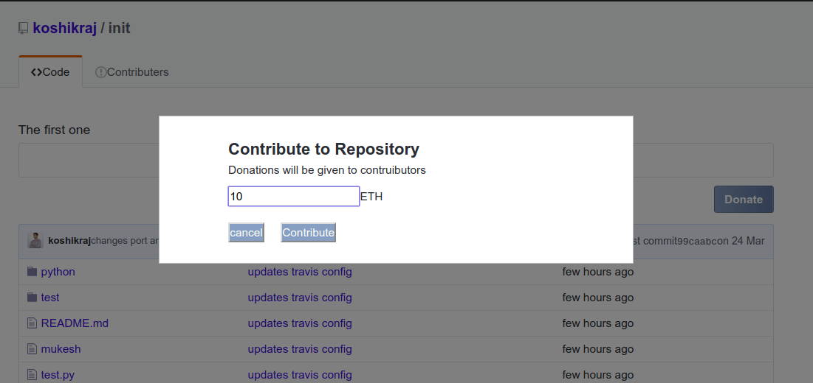
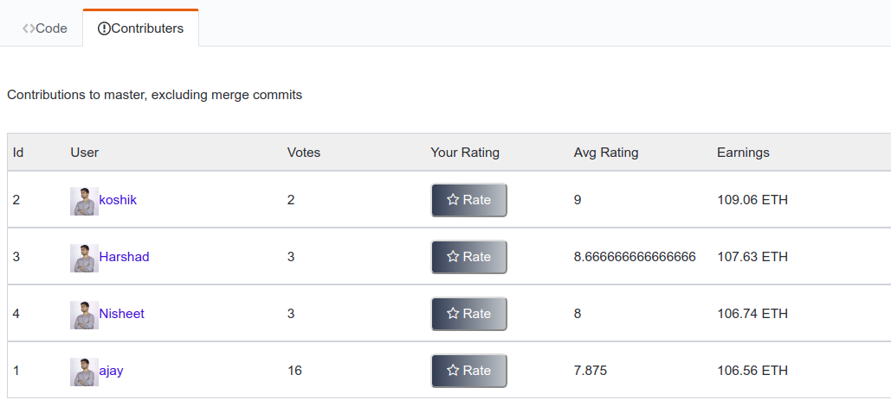
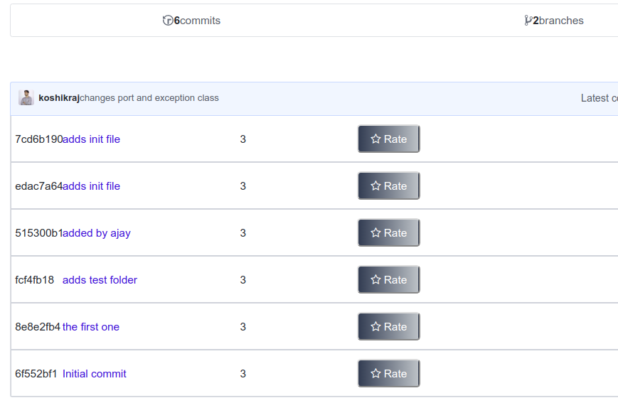

# accenture_hackathon
Docs, presentation of ideas for Accenture hackathon

## Communication and tracking project
* Let's use the GitHub's project tracker, it looks decent.
* Join slack channel https://accenturehackathon18.slack.com for all communication.
* This is a private repository, so, we can use this to share any docs for now. 

## A blockchain based crowd funding mechanism for open source projects.

### Problem statement:
Most of the open source projects hosted on the repository hosting service such as GitHub are created for non profit. But, as the project grows, more number of developers will contribute to the project. Some of the developers will start dedicating most of their time to the project. Most of these developers get engaged in the project without earning for their contributions. Some of the projects will try to earn donations with the help of third party applications and use the donations for the project development. Few of the organizations who have open sourced the projects will pay the developers with the money raised for the project. Although the open source projects have found few methods to raise money, there doesn't exist any efficient way to crowd fund and pay the incentives to the contributors in a fair way.

### Proposed idea:
A solution to the above mentioned problem could be proposed by developing a system where contributions of a developer in the open source projects are rated based on his/her quality of the contributions. Everyone who follows the project can rate each code commit of the developer. FInally, each contributor is rated based on the number of contributions and ratings of those code commits. Crowd sourcing is one of the best applications of the blockchain technology. So, we plan on implementing the crowd funding for the project using the blockchain technology. We will create a system where anyone can back a project using the tokens of the system. These tokens will then be used in the project and also distributed to the developers as incentives. The developers will receive the incentives based on their ratings. This is achieved by creating a smart contract that can store the ratings for the contributions of the project and distribute the tokens when ever the project is funded.

### Proposed system:
A GitHub like repository hosting service for open source projects that will rate the contributors based on the number of commits and quality of each commit. When someone wants to fund a project, he/she will send the contribution amount to an address dedicated to the project. The a mount will be sent to the blockchain smart contract, and it will be shared among the project contributors based on their rating.

### Main Components:
GitHub like repository hosting service that will rate the contributors and accept contributions.
A smart contract to store the ratings and distribute the tokens.
Light weight client to store and retrieve token details of the contributors.
Additional enhancement
We are planning to build a centralized hosting service like GitHub and integrate with the blockchain ledger to manage automation of crowd funding. But, to build a completely decentralized application, we can also create the hosting service using distributed file sharing protocol such as InterPlanetary File System (IPFS).

## Quick start

### deploy smart contract

* Pre requisite

    * Run a local Ethereum client with RPC port 8545 connected to private or test network

*   Perform truffle migrate to deploy the contract

    * Navigate to folder `./crowd-fund-fe`

    * `truffle migrate`

    *   Copy the generate ABI file `./migrations/Voting.json` to `./src/contracts`
    
* Run the React application    
    * Go to root folder

    * `npm install`

    * `npm start`

* Deploy and run the middleware backend application 
    
    * Open new window

    * `cd api`

    * `pip install -r requirement.txt`

    * `python app.py`

### Screenshots of React app

 
